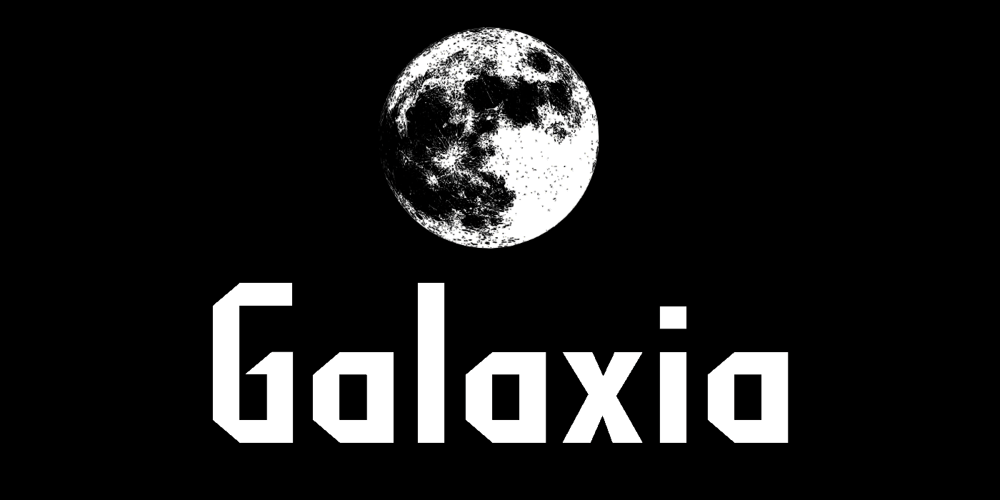

<p align="center"></p>

# Galaxia

Galaxia is a web application that allows users to explore and interact with images from space, obtained through NASA's API. The app provides various galleries, including the Sun, Moon, Venus and Mars curiosity, where users can browse captivating space images. Users also have the ability to create a profile, and contribute by adding their own space-related photographs to their private gallery.

### Features

Save favorite images for quick access.
Contribute by uploading and sharing your own space images.
Edit or delete the images you have added.
Search functionality to find specific images or explore related content.

### Usage

Upon accessing Galaxia, users can start exploring the space image galleries without the need to create an account. However, by registering and logging in, users gain additional features such as the ability to save favorite images and contribute their own content.

- Browse galleries: Visit the different galleries, including the Sun, Moon, Venus and Mars curiosity, to view breathtaking space images.

- User registration: Create a personalized account to unlock additional features.

- Favorites: Save your favorite images by clicking the "Add to Favorites" button. You can access them later through your profile.

- Contribute images: Share your own space-related photographs with the community by uploading them to the respective galleries.

- Edit and delete images: If you have contributed images, you can edit or delete them as needed through your profile.

## Installation

To run Galaxia locally, please follow these steps:

1. Clone the repository from GitHub:

   ```bash
   git clone https://github.com/lenaimdahl/Nasa-Library.git
   ```

2. Install the necessary dependencies using npm:

   ```bash
   cd galaxia
   npm install
   ```

3. Set up the MongoDB database:

   1. Install MongoDB if you haven't already (https://docs.mongodb.com/manual/installation/).
   1. Configure the MongoDB connection in the app's configuration file.

4. Obtain an API key from NASA's API:

   1. Visit NASA's API website (https://api.nasa.gov/) and sign up for an API key.
   1. Insert your API key into the app's configuration file.

5. Start the application:

   ```bash
   npm start
   ```

6. Access Galaxia in your web browser:
   1. http://localhost:3000/

## Technology Used

The Website was developed using HTML, CSS, MongoDB, Express, NASA's API and JavaScript.

## API Reference

Galaxia relies on NASA's API to fetch space images. Please refer to NASA's API documentation for details on how to use their API and the available endpoints.

## Contributing

Contributions are welcome! If you'd like to contribute to Galaxia, please follow these steps:

## Fork the repository.

Create a new branch for your feature or bug fix.
Make your changes and commit them with descriptive commit messages.
Push your changes to your forked repository.
Submit a pull request, detailing your changes and the motivation behind them.
License
This project is licensed under the MIT License.

## Author

This game was created by [Lena Imdahl](https://github.com/lenaimdahl) and [Natassa Tsapanidou-Kornilaki](https://github.com/natko22). If you have any questions or feedback, please feel free to [open an issue](https://github.com/lenaimdahl/Nasa-Library/issues/new). 🙂
Thank you for using Galaxia! We hope you enjoy exploring the wonders of space.
